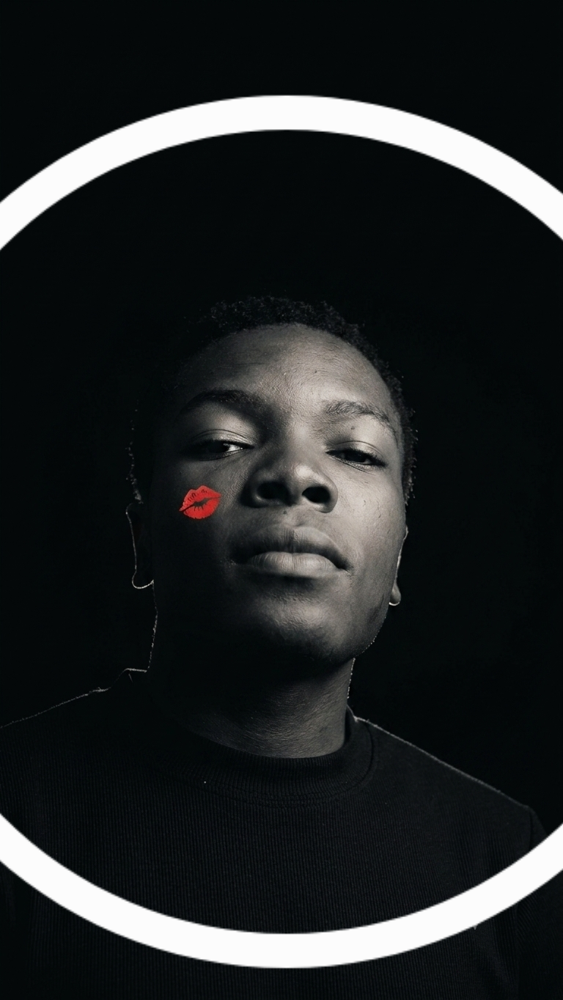

# Python Mastery: From Fundamentals to Architecture

## About the Project
A comprehensive guide to Python programming, covering everything from basic syntax to advanced architectural patterns. This book is designed for developers who want to truly master the Python language.

## Author
**Fahad Mohamed Malibiche**
*Software Engineer from Tanzania*

## Features
- **Neo-Brutalism Design**: A bold, high-contrast user interface.
- **Interactive Learning**: Chapters are served dynamically with a focus on readability.
- **Mobile Optimized**: Fully responsive design for learning on the go.

## Tech Stack
- **Frontend**: React, Vite, Tailwind CSS
- **Styling**: Neo-Brutalism CSS
- **Deployment**: Vercel

---
© 2026 Fahad Mohamed Malibiche
